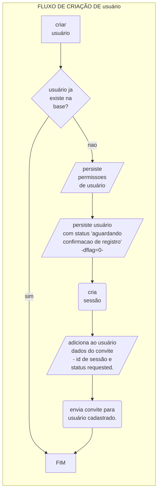
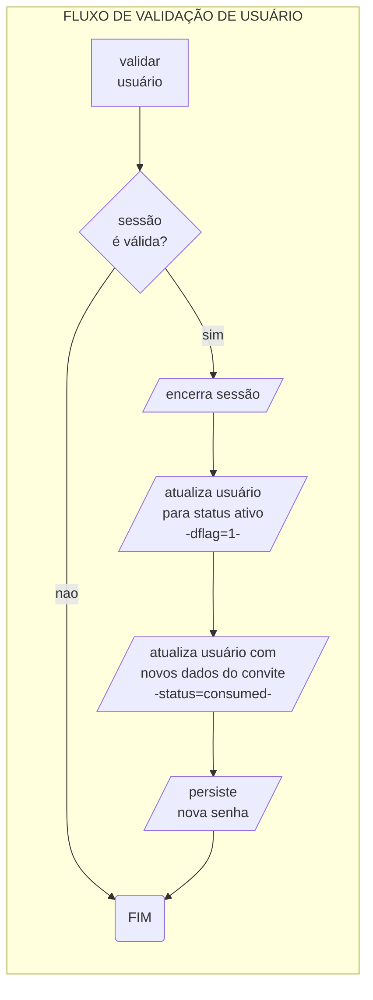

# Criação de usuários no Heimdall v2!
Dentro do ambiente da Zoop, um marketplace pode ter a necessidade de permitir que terceiros (normalmente funcionários ou sócios) tenham acesso ao painel do dashboard para fins de visualização ou gerenciamento do marketplace ou de um seller. Visando isso, foi desenvolvida a feature de criação de usuários, onde um marketplace pode realizar o pré cadastro de usuário, enviando um convite para que o mesmo possa contribuir com as atividades do marketplace ou de um seller específico.

O controle de usuários do Heimdall utiliza o *AWS DynamoDB* como base de dados tendo as tabelas *heimdall-users-{nome_do_ambiente}* para os usuários e *heimdall-v2-permissions-{nome_do_ambiente}* para as permissões do mesmo.
  

### Os usuários podem ser criados a partir de duas rotas:

> /v2/marketplaces/{marketplace_id}/users
- Cria usuários com acesso ao marketplace selecionado
> 
> /v2/marketplaces/{marketplace_id}/sellers/{seller_id}users

- Cria usuários com acesso ao seller selecionado.


Exemplo de body - json.
```
{
      "username": "exemplo@zoop.com.br"  
      "group":  "EXAMPLE_GROUP_V2"  
      "first_name":  "Usuario"  
      "last_name":  "Valido Heimdall V2"
}
```





## Fluxo de criacao de usuário.

Ao criar um novo usuário, Inicialmente é verificado se já não existe associado ao marketplace o nome de usuário que está se tentando criar.(Obs.: se a verificaçãos não der o resultado esperado, o processo é cancelado e o usuário não é criado).

O usuário é persistido com status “aguardando confirmação de registro” (dflag=0). As permissões do usuário também são persistidas na base.

É adicionado ao usuário na base um histórico de convites contendo um campo com informações do envio de “convite de confirmação de usuário” contendo o Id da sessão criada (para que posteriormente o usuário possa ser confirmado) e com type “requested”. O convite de acesso a plataforma é [enviado para o email cadastrado ](#ancora1) <a id="ancora2"></a> contendo um token de acesso a sessão, tendo como resposta 201: created, com um json como o do exemplo.
```
{
      "created_at":  200900000001,  
      "dflag":  0  
      "marketplace_id:  "0162893710a6495e86542eeff192baa1"  
      "origin":  "heimdall"  
      "profile":  {
          "first_name":  "usuário"
          "last_name":  "Valido Heimdall V2"
     }
}
```

## Fluxo de ativação do usuário
Após essa etapa, o futuro usuário receberá uma email o convidando a criar uma conta no Checkout Marketplace.

Ao confirmar a criação de conta, sua solicitação irá para a rota `/v2/marketplaces/{marketplace_id}/users/{user_id}/confirm-invitation`

Obs.: Necessita de um header de Authorization do tipo Bearer com o Token da sessão de criação do usuário(enviada dentro do email de ativação).

exemplo de body - json.
  
  
```
{
      "password":  "Zoop@",
      "confirm_password":  "Zoop@"
}
```
Nesse ponto, será verificada a validade da sessão e se confirmada a memsma é encerrada (excluída da base) e o usuário tem seu status atualizado para “registro ativo” (dflag=1), é adicionado ao histórico de convites uma ocorrência com o id da sessão com o status “consumed” e tem sua nova senha adicionada a seu registro, retornando 204.
  





___
___
___
  
<a id="ancora1"></a>  
## O Envio do e-mail de convite 

Para o envio, são adicionados ao e-mail o id marketplace, id do usuário criado, o nome de usuário (que também é o endereço de email), um template de e mail e o token de acesso a sessão. É verificada a existência do marketplace na base e caso exista, são trazidos dados do marketplace para o preenchimento do e-mail e enviados a um lambda que dispara o e-mail. [voltar](#ancora2)

